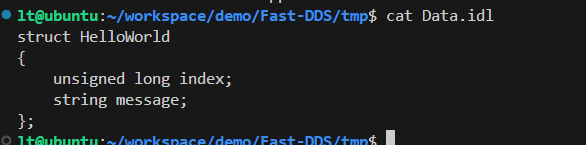

官网地址：https://www.eprosima.com/

环境：Ubuntu 20.04

安装依赖，参考https://fast-dds.docs.eprosima.com/en/latest/installation/sources/sources_linux.html：

sudo apt install libasio-dev libtinyxml2-dev

# 编译安装 Foonathan memory ，提供了经过优化的分配器：

git clone https://github.com/foonathan/memory.git

cd memory

mkdir build && cd build

#默认安装路径：/usr/local
cmake ..
make
sudo make install
# 编译安装 Fast CDR ，提供了两种序列化机制：

git clone https://github.com/eProsima/Fast-CDR.git

git check 3.x
mkdir Fast-CDR/build && cd Fast-CDR/build
cmake ..
make
sudo make install
#默认安装目录 /user/local
# 安装编译 Fast-DDS：

git clone https://github.com/eProsima/Fast-DDS.git

mkdir Fast-DDS/build
git checkout 2.14.0
cd Fast-DDS/build
cmake ..
make
sudo make install

编译代码生成工具 Fast-DDS Gen (需要先装好Java和Gradle)：（选装）

git clone --recursive https://github.com/eProsima/Fast-DDS-Gen.git

## 安装gradle
https://gradle.org/releases/

下载安装6.5版本
unzip gradle-6.5-all.zip
cd gradle-6.5/bin
#将当前目录设置到环境变量中 
vim ~/.bashrc
export PATH=/home/lt/Downloads/gradle-6.5/bin:$PATH
source .bashrc
## 安装javajdk
   sudo apt install openjdk-11-jdk

## 编译fastddsgen
cd Fast-DDS-Gen
gradle assemble
cd scripts

将当前目录设置到环境变量中

自动构建代码

fastddsgen -example CMake Data.idl

mkdir build
cd build
cmake ..
make
运行效果截图

